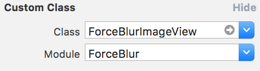

# ForceBlur


[](https://img.shields.io/cocoapods/v/ForceBlur.svg)

Inspired by [this project on Dribbble](https://dribbble.com/shots/3010426-ForceBlur-Component)


Read how we made it [on our blog](https://yalantis.com/blog/forceblur-animation-ios/)

## Features

- [x] Display private content
- [x] Easy to use
- [x] Use with storyboards, XIBs, code
- [x] Compatible with [JSQMessagesViewController](https://github.com/jessesquires/JSQMessagesViewController)

## ForceBlurImageView

- iOS 9+
- Xcode 8
- Swift 3

## Usage

### In interface builder (storyboard, xib)

To use the component in interface builder you need to set custom class for UIImageView:



Also make sure the module is set to `ForceBlur`.

### In code

You can treat `ForceBlurImageView` as `UIImageView`:

``` swift
let imageView = ForceBlurImageView(image: image)
```

### With JSQMessagesViewController

Use `ForceBlurPhotoMediaItem` instead of `JSQPhotoMediaItem`, that's it!

Normal photo:

``` swift
let photoItem = JSQPhotoMediaItem(image: image)
```

Blurred photo:

``` swift
let photoItem = ForceBlurPhotoMediaItem(image: image)
```

## Installation

### [CocoaPods](https://cocoapods.org/)

```
pod 'ForceBlur', '~> 1.0'
```

For JSQMessagesViewController extension add:

```
pod 'ForceBlur/JSQMessagesViewController', '~> 1.0'
```

The dependency includes JSQMessagesViewController itself.

## Let us know!

We’d be really happy if you sent us links to your projects where you use our component. Just send an email to github@yalantis.com And do let us know if you have any questions or suggestion regarding the animation. 

P.S. We’re going to publish more awesomeness wrapped in code and a tutorial on how to make UI for iOS (Android) better than better. Stay tuned!

## License

The MIT License (MIT)

Copyright (c) 2016 Yalantis

Permission is hereby granted, free of charge, to any person obtaining a copy
of this software and associated documentation files (the "Software"), to deal
in the Software without restriction, including without limitation the rights
to use, copy, modify, merge, publish, distribute, sublicense, and/or sell
copies of the Software, and to permit persons to whom the Software is
furnished to do so, subject to the following conditions:

The above copyright notice and this permission notice shall be included in all
copies or substantial portions of the Software.

THE SOFTWARE IS PROVIDED "AS IS", WITHOUT WARRANTY OF ANY KIND, EXPRESS OR
IMPLIED, INCLUDING BUT NOT LIMITED TO THE WARRANTIES OF MERCHANTABILITY,
FITNESS FOR A PARTICULAR PURPOSE AND NONINFRINGEMENT. IN NO EVENT SHALL THE
AUTHORS OR COPYRIGHT HOLDERS BE LIABLE FOR ANY CLAIM, DAMAGES OR OTHER
LIABILITY, WHETHER IN AN ACTION OF CONTRACT, TORT OR OTHERWISE, ARISING FROM,
OUT OF OR IN CONNECTION WITH THE SOFTWARE OR THE USE OR OTHER DEALINGS IN THE
SOFTWARE.
